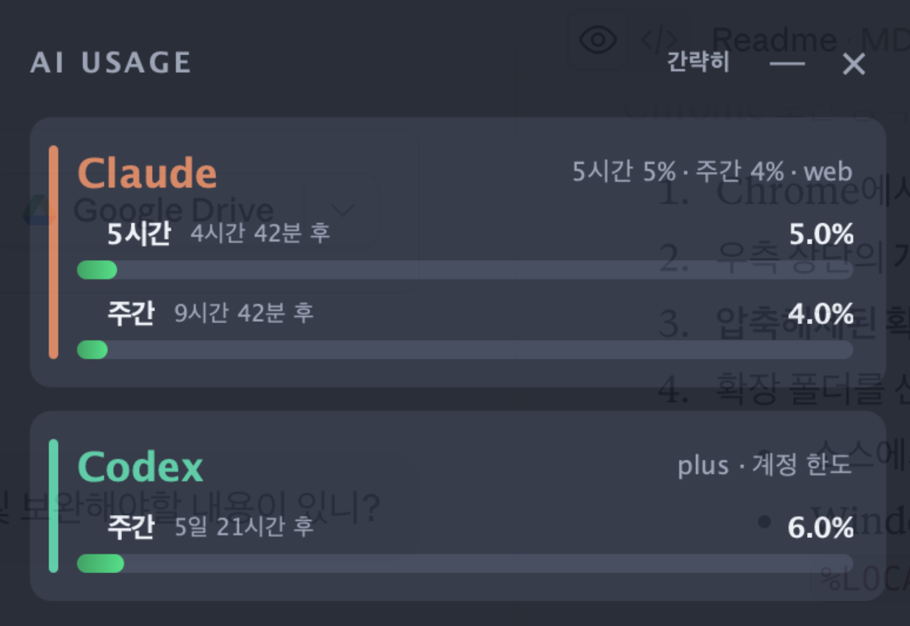
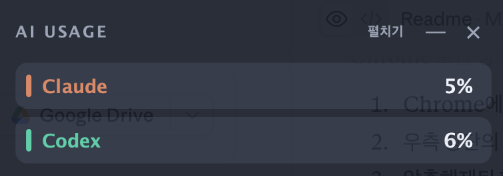

# AI Usage Widget

  

Claude, Codex, Antigravity, Cursor, GitHub Copilot의 **계정 사용 한도**를 데스크톱에서 한눈에 보여 주는 로컬 위젯입니다. Java Swing으로 만들어졌으며, Windows 사용을 기준으로 설계되었지만 macOS·리눅스에서도 빌드·실행할 수 있습니다.

> **EN** — A local desktop widget that shows your account usage limits for Claude, Codex, Antigravity, Cursor, and GitHub Copilot at a glance. Claude and Cursor are read through a companion Chrome extension using your signed-in browser session; Codex, Antigravity, and Copilot are read from local data. Everything stays on your machine — see [프라이버시 & 보안](#프라이버시--보안). Documentation is in Korean.

> 이 프로젝트는 Anthropic·OpenAI·Google·Cursor·GitHub와 무관한 **비공식 도구**입니다. 현재 대화의 토큰이나 컨텍스트 사용률은 표시하지 않으며, Claude 데스크톱·웹·Code의 사용 한도는 같은 계정에서 공유됩니다.

## 미리보기

| 펼치기 모드 | 간략히 모드 |
|---|---|
|  |  |

## 목차

- [주요 기능](#주요-기능)
- [동작 방식](#동작-방식)
- [다운로드](#다운로드)
- [설치 및 실행](#설치-및-실행)
- [브라우저 확장 프로그램 설치](#브라우저-확장-프로그램-설치)
- [소스에서 빌드](#소스에서-빌드)
- [배포 파일 만들기](#배포-파일-만들기)
- [프로젝트 구조](#프로젝트-구조)
- [문제 해결](#문제-해결)
- [동작상 주의점](#동작상-주의점)
- [프라이버시 & 보안](#프라이버시--보안)
- [로컬 HTTP 인터페이스](#로컬-http-인터페이스)
- [면책 조항](#면책-조항)

## 주요 기능

| 에이전트 | 표시 항목 | 조회 방식 |
|---|---|---|
| **Claude** | 5시간/주간 계정 한도, 초기화까지 남은 시간 | 브라우저 확장 (로그인된 세션) |
| **Codex** | 세션 이벤트에 존재하는 한도 구간(5시간·주간 등), 초기화까지 남은 시간 | 로컬 세션 로그 (`~/.codex/sessions`) |
| **Antigravity** | Gemini Models 주간 한도, 초기화 시간 | 실행 중인 language server의 로컬 API |
| **Cursor** | 월간 플랜 사용률, 결제 주기 종료 시각 | 브라우저 확장 (로그인된 세션) |
| **Copilot** | 월간 프리미엄 요청 사용률 | 로컬 로그인 토큰 (`github-copilot`) |

- 사용량이 실제로 조회되는 에이전트만 카드로 표시됩니다. 예를 들어 Antigravity 앱이 꺼져 있으면 해당 카드는 보이지 않다가, 조회가 되기 시작하면 자동으로 추가됩니다.
- 타이틀 바의 **간략히 / 펼치기** 버튼으로 표시 방식을 전환할 수 있고, 선택한 모드는 다음 실행에도 유지됩니다.
  - **간략히**: 에이전트별 대표 사용률(여러 한도 중 가장 높은 값)만 한 줄로 표시
  - **펼치기**: 한도 구간별 퍼센트·초기화 시간·그래프까지 표시
- 트레이 아이콘(맥에서는 메뉴 막대 아이콘) 메뉴에서 에이전트별 요약 확인, 간략히↔펼치기 전환, 위젯 보이기/숨기기가 가능합니다.
- 위젯은 한 번에 하나만 실행됩니다. 이미 실행 중일 때 다시 실행하면 기존 창이 앞으로 나옵니다.
- 위젯의 `×`는 종료, `—`는 트레이로 숨기기입니다. 창 상단을 드래그해 위치를 옮길 수 있습니다.

## 동작 방식

두 가지 경로로 사용량을 수집합니다.

1. **브라우저 확장 (Claude·Cursor)** — Chrome 확장이 로그인된 브라우저 세션으로 5분마다 사용량을 조회해 로컬 위젯(`http://127.0.0.1:32145`)으로 전달합니다. 확장 프로그램은 쿠키나 인증 토큰 값을 직접 읽거나 저장하지 않습니다.
2. **로컬 데이터 (Codex·Antigravity·Copilot)** — 위젯이 직접 로컬 파일과 API를 읽습니다. 브라우저 확장이 필요하지 않습니다.
   - **Codex**: `~/.codex/sessions`에서 가장 최근에 갱신된 JSONL 세션 로그를 감지
   - **Antigravity**: 로그 폴더에서 현재 로컬 서버 포트와 CSRF 연결 정보를 찾아 `RetrieveUserQuotaSummary` 호출
   - **Copilot**: Copilot CLI·JetBrains·Vim 계열이 저장하는 로컬 토큰 파일로 GitHub 내부 API 조회

에이전트별 로컬 데이터 경로는 실행 시 OS를 감지해 자동으로 결정됩니다.

| 에이전트 | Windows | macOS | 리눅스 |
|---|---|---|---|
| Antigravity | `%APPDATA%\Antigravity\logs` | `~/Library/Application Support/Antigravity/logs` | `~/.config/Antigravity/logs` |
| Copilot | `%LOCALAPPDATA%\github-copilot` | `~/.config/github-copilot` | `~/.config/github-copilot` |
| Codex | `~/.codex/sessions` | `~/.codex/sessions` | `~/.codex/sessions` |

## 다운로드

빌드된 배포 파일은 [Releases](../../releases) 페이지에서 내려받을 수 있습니다.

- Windows: `AIUsageWidget-portable.exe`
- macOS: `AIUsageWidget-<버전>.dmg`

현재 버전은 앱 **1.3.0**, Chrome 확장 **0.5.3**입니다. 변경 이력은 [CHANGELOG.md](CHANGELOG.md)를 참고하세요. 직접 빌드하려면 [소스에서 빌드](#소스에서-빌드)와 [배포 파일 만들기](#배포-파일-만들기)를 참고합니다.

## 설치 및 실행

### Windows — 단일 EXE

배포용 `AIUsageWidget-portable.exe` 하나로 실행합니다. 전용 Java 런타임과 브라우저 확장 프로그램 파일이 모두 포함되어 있어, 대상 PC에 Java를 설치하거나 추가 파일을 내려받을 필요가 없습니다.

처음 실행하면 `%LOCALAPPDATA%\AIUsageWidget`에 필요한 파일을 풀고 위젯을 실행하며, 바탕화면에 **AI Usage Widget** 바로가기를 만들어 줍니다. 이후에는 바로가기나 포터블 EXE 어느 쪽으로 실행해도 같은 위치의 파일을 재사용합니다.

Claude·Cursor 사용량을 보려면 [브라우저 확장 프로그램 설치](#브라우저-확장-프로그램-설치)가 한 번 필요합니다. 이때 확장 폴더는 `%LOCALAPPDATA%\AIUsageWidget\extension`입니다.

### macOS — DMG

`AIUsageWidget-<버전>.dmg`를 열어 앱을 설치합니다. Claude·Cursor 사용량을 보려면 `/Applications/AIUsageWidget.app/Contents/app/extension` 폴더를 확장 프로그램으로 등록합니다.

### 소스에서 바로 실행

JDK 17 이상이 설치되어 있다면 배포 파일 없이 바로 실행할 수 있습니다. [소스에서 빌드](#소스에서-빌드)를 참고하세요.

## 브라우저 확장 프로그램 설치

Claude·Cursor 조회에만 필요합니다(Antigravity·Codex·Copilot은 불필요). Chrome 보안 정책상 압축해제된 확장은 한 번은 수동으로 등록해야 합니다.

1. Chrome에서 `chrome://extensions`를 엽니다.
2. 우측 상단의 **개발자 모드**를 켭니다.
3. **압축해제된 확장 프로그램을 로드합니다**를 누릅니다.
4. 확장 폴더를 선택합니다.
   - 소스에서 실행: 이 프로젝트의 `extension` 폴더
   - Windows EXE 설치: `%LOCALAPPDATA%\AIUsageWidget\extension`
   - macOS DMG 설치: `/Applications/AIUsageWidget.app/Contents/app/extension`
5. 기존에 설치한 버전이 있다면 확장 프로그램 카드의 **새로고침** 버튼을 누릅니다(권한에 cursor.com이 추가되었습니다).
6. Chrome에서 Claude(및 사용한다면 Cursor)에 로그인되어 있는지 확인합니다. 설정 페이지를 열어 둘 필요는 없습니다.

확장 프로그램은 5분마다 사용량을 조회하며, 확장 아이콘을 눌러 **지금 갱신**할 수도 있습니다.

## 소스에서 빌드

공통 요구 사항은 **JDK 17 이상**입니다. 위젯은 Windows 사용을 기준으로 설계되어 있어 맥·리눅스에서도 빌드와 실행은 되지만 일부 에이전트 조회가 제한될 수 있습니다.

### Windows

PowerShell에서 실행합니다. `build.ps1`이 컴파일·아이콘 리소스 복사·테스트까지 수행합니다.

```powershell
Set-ExecutionPolicy -Scope Process Bypass

.\build.ps1          # 컴파일 + 테스트
.\run.ps1            # 위젯 실행 (빌드가 없으면 자동 빌드)
```

탐색기에서 `run.cmd`를 더블 클릭해도 됩니다(최초 빌드 자동 수행). 콘솔 오류를 확인하면서 실행하려면 `run-console.ps1`, Codex 로그·Antigravity·Copilot 조회 상태만 확인하려면 `diagnose.ps1`을 사용합니다.

### macOS / 리눅스

```bash
bash build.sh   # 컴파일 + 아이콘 리소스 복사 + 테스트
bash run.sh     # 위젯 실행 (빌드가 없으면 자동 빌드)
```

스크립트 없이 직접 실행하려면 다음 명령을 사용합니다.

```bash
# 컴파일
mkdir -p build/classes build/test-classes
javac --release 17 -encoding UTF-8 -d build/classes $(find src/main/java -name '*.java')
javac --release 17 -encoding UTF-8 -d build/test-classes $(find src -name '*.java')

# 아이콘 리소스를 클래스패스에 복사
mkdir -p build/classes/assets build/test-classes/assets
cp assets/*.png build/classes/assets/
cp assets/*.png build/test-classes/assets/

# 테스트
java -ea -cp build/test-classes dev.tokenwidget.UsageParserTest

# 위젯 실행
java -cp build/classes dev.tokenwidget.App
```

GUI가 없는 환경(서버·CI)에서는 테스트에 `-Djava.awt.headless=true`를 추가하고, 화면 렌더링 검증까지 하려면 가상 디스플레이에서 스모크 테스트를 실행할 수 있습니다.

```bash
java -ea -Djava.awt.headless=true -cp build/test-classes dev.tokenwidget.UsageParserTest
xvfb-run -a java -ea -cp build/test-classes dev.tokenwidget.WidgetSmokeTest   # 선택
```

리눅스에서 한글 UI를 표시하려면 한글 글꼴(예: `fonts-noto-cjk` 또는 `fonts-nanum`) 설치가 필요합니다.

## 배포 파일 만들기

jpackage는 크로스 패키징을 지원하지 않으므로 **EXE는 윈도우에서, DMG는 맥에서** 만들어야 합니다. 둘 다 jar·jpackage가 포함된 전체 JDK 17 이상이 필요합니다.

### Windows 단일 EXE

```powershell
.\package-exe.ps1
```

산출물은 `dist\AIUsageWidget-portable.exe`(약 26MB)입니다.

> **배포 시 주의**: 다른 사람에게 전달할 파일은 `dist\AIUsageWidget-portable.exe` **하나뿐**입니다. `build\package-output\AIUsageWidget\` 안의 `AIUsageWidget.exe`(약 450KB)는 같은 폴더의 `app\`·`runtime\`이 있어야만 실행되는 내부 런처라서 단독으로 전달하면 `AIUsageWidget.cfg ... No such file or directory` 오류가 납니다. `build\` 아래의 중간 산출물은 전달 대상이 아닙니다.

### macOS DMG

```bash
bash package-dmg.sh
```

산출물은 `dist/AIUsageWidget-<버전>.dmg`이며, 앱 아이콘(`assets/app-icon.icns`)과 Chrome 확장 프로그램이 함께 들어갑니다.

## 프로젝트 구조

```
token-usage-widget/
├── src/main/java/dev/tokenwidget/
│   ├── App.java                    # 진입점, 단일 인스턴스 보장, 폴링 스케줄러
│   ├── UsageWidget.java            # 위젯 UI (Swing)
│   ├── BrowserUsageServer.java     # 127.0.0.1:32145 로컬 HTTP 서버 (Claude·Cursor 수신)
│   ├── CodexUsageReader.java       # ~/.codex/sessions JSONL 리더
│   ├── AntigravityUsageReader.java # Antigravity 로컬 API 리더
│   ├── CopilotUsageReader.java     # Copilot 로컬 토큰 기반 리더
│   ├── ProviderUsage.java          # 에이전트별 사용량 모델
│   ├── UsageLimit.java             # 한도 구간 모델
│   └── Diagnostics.java            # 진단 출력
├── src/test/java/dev/tokenwidget/
│   ├── UsageParserTest.java        # 파서 단위 테스트
│   └── WidgetSmokeTest.java        # UI 스모크 테스트
├── extension/                      # Chrome 확장 (Claude·Cursor 브리지)
├── docs/                           # README용 스크린샷
├── assets/                         # 앱·트레이 아이콘 리소스
├── packaging/launcher.cmd          # Windows 포터블 EXE 내부 런처
├── build.ps1 / build.sh            # 빌드 스크립트 (Windows / macOS·리눅스)
├── run.ps1 / run.cmd / run.sh      # 실행 스크립트
├── run-console.ps1                 # 콘솔 출력을 보며 실행 (Windows)
├── diagnose.ps1                    # 로컬 조회 상태 진단 (Windows)
├── java-toolchain.ps1              # JDK 탐지 공용 스크립트 (Windows)
├── package-exe.ps1                 # Windows 배포용 단일 EXE 생성
└── package-dmg.sh                  # macOS 배포용 DMG 생성
```

`build/`(빌드 중간 산출물)와 `dist/`(배포 파일)는 빌드 시 생성되며 git에는 포함되지 않습니다.

## 문제 해결

**특정 에이전트 카드가 안 보여요.**
사용량이 조회되지 않는 에이전트는 카드가 자동으로 숨겨집니다. 에이전트별 확인 사항은 다음과 같습니다.

- **Claude·Cursor**: 브라우저 확장이 설치·활성화되어 있는지, Chrome에서 해당 서비스에 로그인되어 있는지 확인합니다.
- **Antigravity**: 앱이 실행 중이어야 합니다. 앱을 켜면 카드가 자동으로 추가됩니다.
- **Codex**: 이 컴퓨터에서 Codex 세션을 실행한 기록이 있어야 합니다. 마지막 스냅샷의 모든 한도 구간이 초기화 시점을 지났으면 카드가 숨겨지고, 새 세션이 값을 보고하면 자동으로 복구됩니다.
- **Copilot**: 로컬 토큰 파일이 있어야 합니다. VS Code만 사용하는 경우 토큰 파일이 없어 카드가 표시되지 않을 수 있고, 프리미엄 요청이 무제한인 요금제는 퍼센트를 계산할 수 없어 표시되지 않습니다.

모든 에이전트가 조회되지 않으면 "조회 가능한 사용량이 아직 없습니다"가 표시됩니다. Windows에서는 `diagnose.ps1`로 Codex·Antigravity·Copilot 조회 상태를 확인할 수 있습니다.

**Claude·Cursor 값에 `갱신 지연`이 표시돼요.**
마지막 수신 후 7분 이상 지난 캐시값이라는 뜻입니다. 확장 프로그램 아이콘을 눌러 **지금 갱신**을 누르거나, 확장이 켜져 있는지 확인하세요.

**확장 프로그램이 꺼져 있어요.**
확장 파일이 새 버전으로 교체되면 확장이 1분 이내에 스스로 다시 로드하지만, Chrome이 확장을 **비활성화**해버린 경우(파일 교체를 손상으로 판단하는 경우 등)는 보안 정책상 자동 복구가 불가능합니다. `chrome://extensions`에서 직접 다시 켜야 합니다. 압축해제 확장의 근본적인 한계이며, 완전한 자동 업데이트가 필요하면 Chrome 웹 스토어 배포가 필요합니다.

**Codex 값이 다른 컴퓨터와 달라요.**
Codex 값은 실시간 조회가 아니라 **이 컴퓨터의 마지막 Codex 세션 시점 스냅샷**입니다. 다른 컴퓨터에서 사용한 양은 이 컴퓨터에서 새 Codex 세션을 실행해야 반영됩니다. 스냅샷이 10분 이상 오래되면 카드에 관찰 시점(예: `4일 전 기록`)이 표시됩니다.

**Windows에서 `AIUsageWidget.cfg ... No such file or directory` 오류가 나요.**
`build\package-output\` 안의 내부 런처 EXE를 단독으로 실행한 경우입니다. 배포용 파일은 `dist\AIUsageWidget-portable.exe`이며, 이 파일을 사용하세요.

## 동작상 주의점

- Claude·Cursor·Copilot의 계정 한도 API는 공식 공개 API가 아니므로 제공사가 경로나 응답 구조를 변경하면 업데이트가 필요할 수 있습니다.
- Claude·Cursor는 5분 간격으로 자동 갱신되고, Copilot은 5분 간격으로 로컬에서 조회합니다.
- 위젯을 껐다가 다시 켜면 마지막으로 수신한 Claude·Cursor 사용량을 로컬 캐시에서 **즉시** 복원해 표시합니다(24시간 이내 데이터만). 확장 프로그램도 30초 주기의 브리지 핑으로 위젯 재시작을 감지해 최신값을 다시 전송합니다.
- Codex는 세션 이벤트에 실제로 존재하고 아직 만료되지 않은 한도 구간만 행으로 표시합니다. 여러 Codex 작업이 동시에 실행 중이면 가장 최근에 로그가 갱신된 작업이 표시되고, 가장 최근 세션 파일에 아직 한도 이벤트가 없으면 이전 세션 파일의 마지막 스냅샷으로 폴백합니다.
- Antigravity v2.2.1의 현재 응답은 Gemini Models의 주간 한도만 제공하므로 주간 행만 표시됩니다.

## 프라이버시 & 보안

- **모든 데이터는 이 컴퓨터 안에만 머뭅니다.** 위젯과 브라우저 확장은 `127.0.0.1:32145` 로컬 HTTP로만 통신하며, 사용량 데이터를 외부 서버로 전송하거나 수집하지 않습니다. 텔레메트리도 없습니다.
- 브라우저 확장은 쿠키나 인증 토큰 값을 직접 읽거나 저장하지 않습니다. 로그인된 브라우저 세션 그대로 각 서비스의 사용량 API를 호출할 뿐입니다. 요청 대상 도메인은 `extension/manifest.json`의 `host_permissions`에서 확인할 수 있습니다.
- Copilot 조회는 Copilot CLI 등이 로컬에 저장해 둔 토큰 파일을 읽어 GitHub 사용량 API 호출에만 사용하며, 토큰을 다른 곳에 저장하거나 전송하지 않습니다.
- 모든 코드가 이 저장소에 공개되어 있어 직접 확인하고 빌드할 수 있습니다.

## 로컬 HTTP 인터페이스

브라우저 확장과 위젯은 로컬 HTTP로 통신합니다.

- 상태 확인: `GET http://127.0.0.1:32145/health`
- Claude 사용량 수신: `POST http://127.0.0.1:32145/claude-usage`
- Cursor 사용량 수신: `POST http://127.0.0.1:32145/cursor-usage`

Claude 예시 페이로드:

```json
{
  "sessionPercent": 23.5,
  "sessionResetAt": "2026-07-14T05:00:00Z",
  "weeklyPercent": 41,
  "weeklyResetAt": "2026-07-20T05:00:00Z",
  "sourceUrl": "claude-internal-api"
}
```

Cursor 예시 페이로드:

```json
{
  "monthlyPercent": 52,
  "monthlyResetAt": "2026-08-01T00:00:00Z",
  "plan": "pro"
}
```

## 면책 조항

이 프로젝트는 Anthropic, OpenAI, Google, Cursor(Anysphere), GitHub(Microsoft)와 무관한 개인 프로젝트이며, 각 사의 승인·후원·제휴를 받지 않았습니다. Claude·Cursor·Copilot의 계정 한도 조회는 공식 공개 API가 아닌 내부 API에 의존하므로 제공사의 변경에 따라 언제든 동작이 중단될 수 있습니다. 각 서비스의 이용 약관을 준수할 책임과 이 도구의 사용에 따른 책임은 사용자 본인에게 있습니다.
